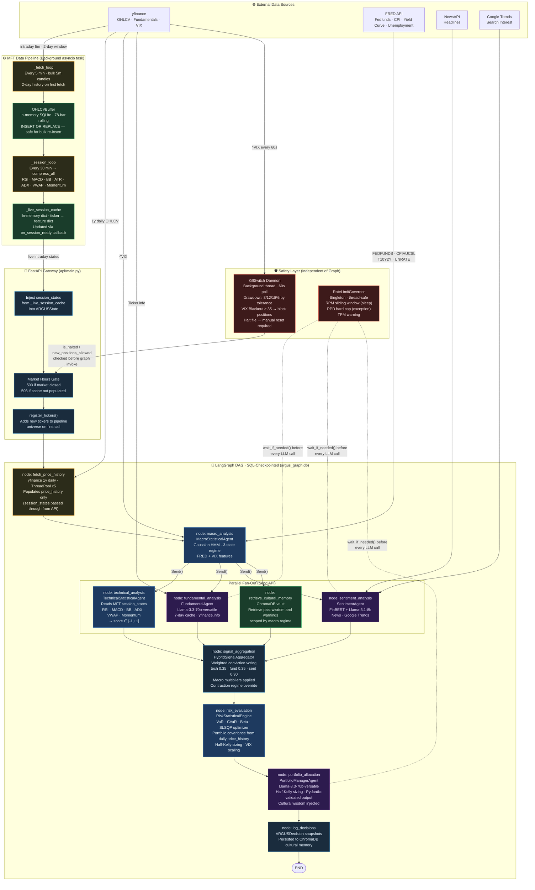

# ARGUS

Multi-agent financial intelligence system orchestrating specialist LLMs and statistical models for quantitative equity research.


> **RESEARCH PROJECT ONLY — NOT FINANCIAL ADVICE.** ARGUS is not registered with the SEC or any regulatory body. All outputs are for educational and research purposes only. Do not make investment decisions based on this system's output.

## Overview

ARGUS is a multi-agent artificial intelligence system for quantitative equity research. By orchestrating six specialized agents (Technical, Macro, Fundamental, Sentiment, Risk, and Portfolio) as a directed acyclic graph (DAG), ARGUS synthesizes structured investment theses and asset allocations. See [`limitations.md`](limitations.md) for the current, honestly-stated gaps in this system.

- **Parallel Agent Orchestration** — delegates analysis to domain-specific statistical models and LLMs, improving decision accuracy over monolithic prompts.
- **Strict Point-in-Time Gating** — masks future data during historical backtesting, completely preventing look-ahead and survivorship biases.
- **High-Frequency Data Pipeline** — buffers intraday OHLCV data using an in-memory SQLite ring buffer, enabling near-real-time technical indicator derivation.
- **Dual-Gate Rate Limiting** — enforces strict per-minute and per-day token/request quotas, preventing API exhaustion and cost overruns.
- **Automated Drawdown Kill-Switch** — continuously monitors portfolio risk metrics and automatically halts operations during extreme volatility (e.g., VIX spikes).
- **Persistent Cultural Memory** — stores past decision rationale in a ChromaDB vector vault, allowing the Portfolio agent to recall historical wisdom across similar market regimes.

## Architecture

ARGUS operates as a stateful LangGraph workflow. Data ingestion is handled by an asynchronous pipeline, while decision logic is distributed across parallel analyst nodes before being aggregated and subjected to a quantitative risk audit. See [`docs/adr/`](docs/adr/) for the reasoning behind specific design decisions.



The system runs in two primary modes:
1. **Live Mode**: Subscribes to the intraday buffer and evaluates current market conditions. 
2. **Backtest Mode**: Invokes the pipeline with point-in-time constraints and evaluates an explicitly scoped historical date window.

## Prerequisites

- **Python**: ≥ 3.12
- **Docker**: Optional, for containerized deployments.
- **System Memory**: Minimum 4GB RAM (due to local FinBERT inference).

## Installation

### Method 1: Docker (Recommended)
```bash
# 1. Clone the repository
git clone https://github.com/your-org/argus.git
cd argus

# 2. Configure environment keys
cp .env.example .env
# Edit .env and supply your required API keys (see Configuration section)

# 3. Build and launch
docker compose up --build -d
```

### Method 2: Local Source
```bash
# 1. Clone and enter directory
git clone https://github.com/your-org/argus.git
cd argus

# 2. Create virtual environment
python3.12 -m venv .venv
source .venv/bin/activate

# 3. Install dependencies
pip install -e ".[dev,test]"

# 4. Start API server
uvicorn api.main:app --host 0.0.0.0 --port 8000
```

### Verify Installation
```bash
curl http://localhost:8000/health
```
```text
{"status": "ok", "system_time": "2024-11-20T10:15:30Z"}
```

## Configuration

Required environment variables must be placed in a `.env` file at the project root.

| Variable | Required? | Description / Default |
|----------|-----------|-----------------------|
| `GROQ_API_KEY` | Yes | Authenticates Llama 3.3-70b/3.1-8b for core agent synthesis. |
| `FRED_API_KEY` | Yes | Retrieves macroeconomic indicators (CPI, Fed Funds, UNRATE). |
| `NEWSAPI_KEY` | Yes | Fetches recent headlines for FinBERT sentiment scoring. |
| `LANGCHAIN_API_KEY` | Optional | Enables LangSmith tracing for LLM observability. |
| `CHROMA_PERSIST_DIR` | Optional | Defines local directory for the vector database. Default: `./chroma_db` |

*Note: Google Trends sentiment analysis does not require an API key.*

## Quick Start / Usage

### Replaying a recorded session
There is no `/backtest` API endpoint — see
[`docs/adr/0009-no-multiyear-backtest.md`](docs/adr/0009-no-multiyear-backtest.md)
for why a multi-year walk-forward backtest isn't offered.
`scripts/replay_backtest.py` replays recorded fixture sessions through the
real graph instead:

```bash
.venv/bin/python -m scripts.replay_backtest
```

## Project Structure

```text
.
├── api/                  # FastAPI entrypoint, HTTP routing, and market-hours gating
├── argus/
│   ├── agents/           # Core AI components (Macro, Fundamental, Sentiment, Risk, Portfolio)
│   ├── backtesting/      # Return-series metrics and fixture-session replay (see ADR 0009)
│   ├── data/             # MFT Pipeline, OHLCV SQLite buffer, and external API fetchers
│   ├── memory/           # ChromaDB-backed cultural wisdom retrieval mechanisms
│   ├── orchestration/    # LangGraph definition, safety governors, and kill-switches
│   └── schemas/          # Pydantic data contracts defining all inter-agent signaling
├── chroma_db/            # (Auto-generated) Local persistent vector database
├── docs/                 # Architecture walkthrough, run guides, project notes
│   └── adr/              # Architecture decision records
├── tests/                # Deterministic unit tests covering agents and pipelines
├── argus_graph.db        # (Auto-generated) SQLite state checkpointer for LangGraph
├── pyproject.toml        # Project dependencies and build configuration
└── docker-compose.yml    # Multi-container orchestration definition
```

## Testing

ARGUS includes a suite of deterministic unit tests that execute without triggering external API calls (via `pytest-mock`), covering core agents, rate limit governors, and the intraday MFT pipeline.

**Run the full test suite:**
```bash
pytest tests/ -v
```

- **Categories**: Tests cover Pydantic validation boundaries, mathematical boundaries (e.g., Half-Kelly position sizing constraints), caching TTL expiration logic, and thread-safe rate limit assertions.
- **Approximate Run Time**: ~4 seconds.

## Contributing

N/A — ARGUS is currently maintained as a private research and portfolio project. External pull requests are closed, though forks for personal experimentation are welcome. See [`CONTRIBUTING.md`](CONTRIBUTING.md) for the standing agent rules used while developing this repo.

## Roadmap

Under active rebuild — see [issue #1](https://github.com/nevilcp/argus/issues/1) for the current plan and its rationale.

## License & Acknowledgements

**License**: Released for Educational and Research Purposes Only.

**Acknowledgements**:
- [LangGraph](https://github.com/langchain-ai/langgraph) for cyclic agent orchestration.
- [ProsusAI/finbert](https://huggingface.co/ProsusAI/finbert) for financial domain sentiment classification.
