# ARGUS

Multi-agent financial intelligence system orchestrating specialist LLMs and statistical models for quantitative equity research.


> **RESEARCH PROJECT ONLY — NOT FINANCIAL ADVICE.** ARGUS is not registered with the SEC or any regulatory body. All outputs are for educational and research purposes only. Do not make investment decisions based on this system's output.

**Contents:** [Overview](#overview) · [Architecture](#architecture) · [Domain Knowledge](#domain-knowledge) · [Prerequisites](#prerequisites) · [Installation](#installation) · [Configuration](#configuration) · [Usage](#quick-start--usage) · [Deployment](#deployment) · [Project Structure](#project-structure) · [Testing](#testing) · [Contributing](#contributing) · [License](#license--acknowledgements)

## Overview

ARGUS is a multi-agent artificial intelligence system for quantitative equity research. By orchestrating six specialized agents (Technical, Macro, Fundamental, Sentiment, Risk, and Portfolio) as a directed acyclic graph (DAG), ARGUS synthesizes structured investment theses and asset allocations.

- **Parallel Agent Orchestration** — delegates analysis to domain-specific statistical models and LLMs rather than a single monolithic prompt, so a bad LLM call in one domain (e.g. sentiment) can't silently corrupt a statistically-grounded one (e.g. risk).
- **Point-in-Time Fixture Replay** — masks future data when replaying recorded sessions through the real graph, so a demo or a determinism check never leaks look-ahead information into the agents it's testing.
- **High-Frequency Data Pipeline** — buffers intraday OHLCV data using an in-memory-speed SQLite ring buffer, enabling near-real-time technical indicator derivation without re-fetching history on every request.
- **Dual-Gate Rate Limiting** — enforces strict per-minute and per-day token/request quotas, preventing API exhaustion and cost overruns.
- **Automated Drawdown Kill-Switch** — continuously monitors portfolio risk metrics, blocks new positions and halts the system during extreme volatility (e.g., VIX spikes) or excess drawdown, requiring a manual reset before trading resumes.
- **Persistent Cultural Memory** — stores past decision rationale in a ChromaDB vector vault, allowing the Portfolio agent to recall past reasoning across similar market regimes as outcomes accumulate and resolve.

## Architecture

ARGUS operates as a stateful LangGraph workflow. Data ingestion is handled by an asynchronous pipeline, while decision logic is distributed across parallel analyst nodes before being aggregated and subjected to a quantitative risk audit.

```mermaid
flowchart TD
    %% ── External Data Sources ────────────────────────────────────────────
    subgraph DATASOURCES["🌐 External Data Sources"]
        direction LR
        YF["yfinance<br/>OHLCV · Fundamentals · VIX"]
        FRED["FRED API<br/>Fedfunds · CPI · Yield Curve · Unemployment"]
        NEWS["NewsAPI<br/>Headlines"]
        GT["Google Trends<br/>Search Interest"]
    end

    %% ── MFT Data Pipeline ────────────────────────────────────────────────
    subgraph PIPELINE["⚙️ MFT Data Pipeline (Background asyncio task)"]
        direction TB
        FL["_fetch_loop\nEvery ~5 min (derived from universe size) · bulk 1m candles\n2-day history on first fetch"]
        BUF["OHLCVBuffer\nPersistent SQLite (data/) · 1,173-bar rolling (1m × 2d + slack)\nINSERT OR REPLACE — safe for bulk re-insert"]
        SL["_session_loop\nEvery 30 min → compress_all\nResamples to 5m · RSI · MACD · BB · ATR · ADX · VWAP · Momentum"]
        CACHE["_live_session_cache\nIn-memory dict · ticker → feature dict\nUpdated via on_session_ready callback"]
    end

    YF -->|"intraday 1m · 2-day window"| FL
    FL --> BUF --> SL --> CACHE

    %% ── FastAPI Gateway ──────────────────────────────────────────────────
    subgraph API["🚪 FastAPI Gateway  (api/main.py)"]
        direction TB
        GATE["Market Hours Gate<br/>503 if market closed<br/>503 if cache not populated"]
        REG["register_tickers()<br/>Adds new tickers to pipeline<br/>universe on first call"]
        INJ["Inject session_states<br/>from _live_session_cache<br/>into ARGUSState"]
    end

    CACHE -->|"live intraday states"| INJ
    INJ --> GATE --> REG

    %% ── LangGraph DAG ────────────────────────────────────────────────────
    subgraph GRAPH["🔁 LangGraph DAG  ·  SQL-Checkpointed  (data/argus_graph.db)"]
        direction TB

        N0["node: fetch_price_history<br/>yfinance 1y daily · ThreadPool x5<br/>Populates price_history only<br/>(session_states passed through from API)"]

        subgraph PARALLEL1["Parallel Fan-Out — macro runs alongside the specialists, not ahead of them"]
            direction LR
            N1["node: macro_analysis<br/>MacroStatisticalAgent<br/>Gaussian HMM · 3-state regime<br/>FRED + VIX features"]
            N2["node: technical_analysis<br/>TechnicalStatisticalAgent<br/>Reads MFT session_states<br/>RSI · MACD · BB · ADX · VWAP · Momentum<br/>→ score ∈ [-1,+1]"]
            N3["node: fundamental_analysis<br/>FundamentalAgent<br/>Llama-3.3-70b-versatile<br/>7-day cache · yfinance.info"]
            N4["node: sentiment_analysis<br/>SentimentAgent<br/>FinBERT + Llama-3.1-8b<br/>News · Google Trends"]
        end

        N6["node: signal_aggregation<br/>HybridSignalAggregator<br/>Weighted conviction voting<br/>tech 0.35 · fund 0.35 · sent 0.30<br/>Conviction scaled to available vote mass, not votes cast<br/>Macro multipliers applied if macro present<br/>Per-regime reliability persisted for later credit assignment<br/>Contraction regime override"]

        subgraph PARALLEL2["Parallel Fan-Out"]
            direction LR
            N5["node: retrieve_cultural_memory<br/>ChromaDB vault<br/>Runs after aggregation — queries on<br/>this session's own aggregated signals<br/>Retrieve past wisdom and warnings<br/>scoped by macro regime"]
            N7["node: risk_evaluation<br/>RiskStatisticalEngine<br/>VaR · CVaR · Beta · SLSQP optimizer<br/>Portfolio covariance from daily price_history<br/>Half-Kelly sizing · VIX scaling"]
        end

        N8["node: portfolio_allocation<br/>PortfolioManagerAgent<br/>Llama-3.3-70b-versatile<br/>Half-Kelly sizing · Pydantic-validated output<br/>Cultural wisdom injected<br/>Degrades gracefully if macro unavailable"]

        N9["node: log_decisions<br/>ARGUSDecision snapshots<br/>Persisted to ChromaDB cultural memory"]

        DONE(["END"])
    end

    %% ── Graph Edges ──────────────────────────────────────────────────────
    REG --> N0
    N0 --> N1 & N2 & N3 & N4
    N1 & N2 & N3 & N4 --> N6
    N6 --> N5 & N7
    N5 & N7 --> N8
    N8 --> N9 --> DONE

    %% ── Data source wiring ───────────────────────────────────────────────
    YF -->|"1y daily OHLCV"| N0
    FRED -->|"FEDFUNDS · CPIAUCSL<br/>T10Y2Y · UNRATE"| N1
    YF -->|"^VIX"| N1
    YF -->|"Ticker.info"| N3
    NEWS & GT --> N4

    %% ── Safety Layer (Independent of Graph) ─────────────────────────────
    subgraph SAFETY["🛡️ Safety Layer  (Independent of Graph)"]
        direction LR
        KS["KillSwitch Daemon<br/>Background thread · 60s poll<br/>Drawdown: 8/12/18% by tolerance<br/>VIX Blackout ≥ 35 → block positions<br/>Halt file → manual reset required"]
        GOV["RateLimitGovernor<br/>Singleton · thread-safe<br/>RPM sliding window (sleep)<br/>RPD hard cap (exception)<br/>TPM warning"]
    end

    YF -->|"^VIX every 60s"| KS
    KS -->|"is_halted / new_positions_allowed<br/>checked before graph invoke"| GATE
    GOV -.-|"wait_if_needed() before<br/>every LLM call"| N3 & N4 & N8

    %% ── Styles ───────────────────────────────────────────────────────────
    classDef stat   fill:#1e3a5f,stroke:#4a90d9,color:#e8f4f8
    classDef llm    fill:#2d1b4e,stroke:#9b59b6,color:#f0e6ff
    classDef safety fill:#3d1a1a,stroke:#e74c3c,color:#ffe8e8
    classDef data   fill:#1a3d2b,stroke:#27ae60,color:#e8f5e9
    classDef io     fill:#2c2c1a,stroke:#f39c12,color:#fff9e6
    classDef api    fill:#1a2c3d,stroke:#3498db,color:#e8f4ff

    class N1,N2,N7 stat
    class N3,N4,N8 llm
    class KS,GOV safety
    class BUF,N5,CACHE data
    class N0,FL,SL io
    class GATE,REG,INJ,N6,N9 api
```



**Legend:** 🔵 blue = statistical model · 🟣 purple = LLM call · 🔴 red = safety layer · 🟢 green = data/cache · 🟠 orange = ingestion I/O · light blue = API layer.

The system runs in three modes:
1. **Live Mode**: A human calls `POST /analyze`, which subscribes to the intraday buffer and evaluates current market conditions on demand.
2. **Unattended Collection**: The same graph runs on its own schedule — see [Deployment](#deployment) — accumulating decisions without anyone calling the API.
3. **Backtest/Replay Mode**: Invokes the pipeline with point-in-time constraints and evaluates an explicitly scoped historical date window from recorded fixtures.

## Domain Knowledge

ARGUS sits at the intersection of quantitative finance, statistical modeling, and LLM agent orchestration. This section is about *what the system means*, not how its code is organized — it's what you need to correctly interpret an `/analyze` response and its evaluation metrics.

### Reading an `/analyze` Response

| Field | Meaning | How to read it |
|---|---|---|
| `conviction` (per position) | Categorical strength of the agents' agreement on a position's direction (e.g. `STRONG_BUY` → `STRONG_SELL`) | Strength of agreement, not a probability of profit or an expected return. Its underlying aggregated score is scaled against the full three-agent vote mass, so it falls when specialists disagree or are absent rather than saturating near its cap whenever the agents who did vote agree |
| `allocation_pct` | Fraction of the *invested* portion of `total_wealth` assigned to this ticker | Multiply by `total_wealth * (1 - cash_reserve_pct)` for a dollar figure — it is not a fraction of total wealth directly |
| `cash_reserve_pct` | Fraction of `total_wealth` held back from any position | Recomputed server-side from the risk engine's own figures rather than trusted verbatim from the LLM, so it always stays consistent with the position sizes actually returned |
| `expected_sharpe` | Portfolio-level expected Sharpe ratio from the risk engine's covariance-based estimate | A model estimate under the current regime, not a guarantee; can be `null` if the risk engine couldn't compute one |
| `macro_regime` | The Gaussian HMM's current 3-state classification (e.g. `EXPANSION`, `CONTRACTION`) | Its multiplier is applied once, at signal-aggregation time, to each specialist's vote weight — never to a specialist's own analysis, which runs independently of macro classification. A `CONTRACTION` regime can still override an otherwise-bullish consensus after aggregation |
| `vix_level` | The VIX close feeding the macro and risk engines this session | Above the configured blackout threshold (default 35), the safety layer blocks new positions before `/analyze` even runs — an elevated-but-sub-threshold value here signals wider risk-engine caution (VIX scaling), not a guarantee of safety |

### Concepts Behind Each Agent

- **Macro regime (Gaussian HMM)** — a Hidden Markov Model fit on FRED macro indicators (CPI, Fed Funds, unemployment, 10Y-2Y yield curve) plus VIX, classifying the current environment into one of three latent regimes rather than a hand-coded rule. It classifies from a trailing ~90-day feature window rather than a single observation, so the transition matrix — not one noisy print — drives the call. The fitted model ships as a committed artifact (`argus-train-macro` retrains it; see [Training the Macro Classifier](#training-the-macro-classifier)); if the artifact is missing or fails to load, the agent degrades to a static VIX/yield-curve rule rather than failing. See [`argus/agents/macro.py`](argus/agents/macro.py).
- **Technical indicators** — fetched as 1-minute intraday candles, resampled to 5-minute bars for indicator calculation, and compressed every 30 minutes. See [`argus/agents/technical.py`](argus/agents/technical.py) and [`argus/data/pipeline.py`](argus/data/pipeline.py).
  - *RSI* (Relative Strength Index): 0–100 momentum oscillator identifying overbought/oversold conditions.
  - *MACD*: trend-following momentum, read via the histogram (the gap between the MACD line and its signal line).
  - *Bollinger %B*: price's position within its rolling volatility bands.
  - *ATR* (Average True Range): a volatility measure in price units, used to scale position sizing.
  - *ADX* (Average Directional Index): 0–100 trend *strength*, independent of direction.
  - *VWAP* (Volume-Weighted Average Price): an intraday benchmark price; distance from it signals whether price is running ahead of or behind volume-weighted flow.
- **Risk measures** — VaR (Value-at-Risk) and CVaR (Conditional VaR / Expected Shortfall) quantify loss size at a confidence level and average loss beyond that level, respectively; beta measures sensitivity to a market benchmark. All three derive from the daily-bar covariance the risk engine estimates from `price_history`. See [`argus/agents/risk.py`](argus/agents/risk.py).
- **Kelly criterion / half-Kelly** — the Kelly criterion computes the wealth-maximizing bet size given a signal's edge; full Kelly is well known to overshoot under real-world estimation error, so ARGUS sizes at half that value.
- **Kill switch / VIX blackout** — independent of the graph, monitored by a background thread: a drawdown kill switch halts all trading once realized portfolio drawdown crosses a risk-tolerance-scaled threshold (8/12/18%, `argus/params.py`'s `KILL_SWITCH` group), and a VIX blackout blocks *new* positions (not existing ones) once VIX crosses a configured level, regardless of drawdown. VIX is read once per `check_interval_seconds` (default 900s) and cached for that long, since it's a daily-close figure. The gate is process-global — one threshold, fixed at startup from `ARGUS_RISK_TOLERANCE` — not per-request; `GET /kill-switch/status` reports its current state. See [`argus/risk/kill_switch.py`](argus/risk/kill_switch.py).

### Interpreting the Evaluation

`scripts/run_evaluation.py` scores replayed decisions against real forward returns using two metrics: rank IC (Spearman correlation between predicted conviction and realized return) and hit-rate with a dead-band (fraction of decisions whose direction matched their realized return, excluding near-zero moves). Both are reported with a bootstrap 95% confidence interval.

At small sample sizes — inherent to a system that has only recently started closing its decision→outcome loop — these intervals routinely span zero. A CI spanning zero means the sample can't yet distinguish "this mechanism has no effect" from "not enough resolved decisions exist yet to see whether it does." Treat a single-digit-`n` evaluation run as a diagnostic on the *measurement*, not evidence about the *system*. The unattended collector (see [Deployment](#deployment)) exists specifically to accumulate enough resolved outcomes that sample size stops being the limiting factor.

### What to Know Before Trusting Output

- **FRED macro data lags real time** by weeks to months; the regime classifier reacts slowly to genuine economic pivots. Windowed inference compounds this deliberately — trading further responsiveness for a call that isn't swung by one noisy print.
- **ROA is used as a proxy for ROIC** — Yahoo Finance's `returnOnAssets` is mapped directly to the `roic` field. The two are mathematically distinct; read capital-efficiency conclusions from the fundamental signal with that substitution in mind.
- **NewsAPI's free tier only returns the trailing 28 days** of headlines — sentiment signals go silently empty/neutral beyond that window.
- **NewsAPI's free tier also caps requests at 100/day**, and delays article availability by roughly 24 hours. A 20-ticker sweep spends 20 of those 100 — a 5-run/day ceiling tighter than any Groq quota — and news-derived sentiment is never same-day by construction.
- **yfinance and pytrends are unofficial clients**, not documented APIs — they drive the private JSON endpoints behind the public Yahoo Finance and Google Trends websites rather than a published, versioned API. There is no rate-limit contract, no `Retry-After` guarantee, and no SLA.
- **No slippage, spread, or market-impact modeling** — allocations are theoretical, not execution-ready.
- **Historical covariance breaks down during shocks** (correlations tend toward 1); VaR/CVaR estimates during genuine crises should be treated as understated.
- **Long-only** — no shorting, options, or hedging; a bearish `macro_regime` can only reduce exposure, not profit from it.
- **LLM outputs are non-deterministic** — the fundamental, sentiment, and portfolio-synthesis agents can return slightly different conviction scores and notes between runs on identical inputs.
- **A macro data outage doesn't blank the session** — if FRED/VIX data is unavailable, `macro_regime` comes back `"unknown"` and `vix_level` `0.0`, but the three specialist agents, aggregation, and portfolio allocation still run on whatever evidence they do have, rather than the whole session being scrapped. The graph's internal state records the specific gap (`state["errors"]`), though `/analyze`'s response schema doesn't currently surface that list to the caller — a `macro_regime` of `"unknown"` is presently the only client-visible signal that this happened.

## Prerequisites

- **Python**: ≥ 3.11
- **Docker**: Optional, for containerized deployments (`Dockerfile.api`, one service). The built image is ~1–1.5GB — it bakes in CPU-only PyTorch plus the FinBERT and sentence-embedding models so no request pays a cold download.
- **System Memory**: Minimum 4GB RAM only if installing the optional `models` extra locally (`pip install -e ".[models]"`), which pulls in local FinBERT inference. The default install and the test suite don't need it.

## Installation

### Method 1: Docker (Recommended)
```bash
# 1. Clone the repository
git clone https://github.com/nevilcp/argus.git
cd argus

# 2. Configure environment keys
cp .env.example .env
# Edit .env and supply your required API keys (see Configuration section)

# 3. Build and launch
docker compose up --build -d
```
`docker-compose.yml` defines a single `argus-api` service (`Dockerfile.api`), passes every key in `.env` through to the container, and — unless overridden in `.env` — enables the unattended collector and daily reconciliation loops by default (`ARGUS_COLLECTOR_ENABLED` / `ARGUS_RECONCILE_ENABLED`). Persistent state lives in two named volumes (`argus-data`, `chroma-db`) rather than bind-mounted files.

### Method 2: Local Source
```bash
# 1. Clone and enter directory
git clone https://github.com/nevilcp/argus.git
cd argus

# 2. Create virtual environment
python3.11 -m venv .venv
source .venv/bin/activate

# 3. Install dependencies
pip install -e ".[dev,test]"

# 4. Start API server
uvicorn api.main:app --host 0.0.0.0 --port 8000
```
The unattended collector defaults to *off* outside Docker (`ARGUS_COLLECTOR_ENABLED=false`); set it in `.env` if you want a bare-metal run to collect on its own too.

### Verify Installation
```bash
curl http://localhost:8000/health
```
```json
{
  "status": "ok",
  "model_versions": {
    "synthesis": "llama-3.3-70b-versatile",
    "sentiment": "llama-3.1-8b-instant",
    "fundamental": "llama-3.3-70b-versatile",
    "finbert": "ProsusAI/finbert"
  },
  "can_make_calls": true,
  "governor_report": { "...": "per-model request/token usage, see /governor/report" }
}
```

## Configuration

Required environment variables must be placed in a `.env` file at the project root. Copy `.env.example` as a starting point and replace each value with your own key — never commit real keys.

### Secrets

| Variable | Required? | Description / Default |
|----------|-----------|-----------------------|
| `GROQ_API_KEY` | Yes | Authenticates Llama 3.3-70b/3.1-8b for core agent synthesis. |
| `FRED_API_KEY` | Yes | Retrieves macroeconomic indicators (CPI, Fed Funds, UNRATE). |
| `NEWSAPI_KEY` | Yes | Fetches recent headlines for FinBERT sentiment scoring. |
| `LANGCHAIN_TRACING_V2` / `LANGCHAIN_API_KEY` / `LANGCHAIN_PROJECT` / `LANGCHAIN_ENDPOINT` | Optional | Enables LangSmith tracing. Read directly by `langchain-core`, not by `argus/config.py`. |

Every secret field defaults to an empty string (see `argus/config.py`) — the process starts without them, but the feature that depends on a missing key degrades or is skipped rather than failing outright (e.g. a missing `FRED_API_KEY` means the macro classifier's rule-based fallback is used instead of live indicators). Google Trends sentiment analysis needs no API key at all.

### Unattended Operation

| Variable | Default | Description |
|----------|---------|-------------|
| `ARGUS_UNIVERSE` | built-in 20-ticker universe | Comma-separated tickers the collector tracks and analyzes. |
| `ARGUS_DATA_DIR` | `data` | Directory for the persistent intraday buffer, checkpoint DB, and decision log. |
| `ARGUS_COLLECTOR_ENABLED` | `false` | Run the graph automatically on a schedule during market hours. |
| `ARGUS_COLLECTOR_INTERVAL_SECONDS` | `3600` | Seconds between automatic collection cycles. |
| `ARGUS_RECONCILE_ENABLED` | `false` | Automatically reconcile matured decisions once a day. |
| `ARGUS_RECONCILE_HOUR_ET` | `17` | Eastern-time hour (0–23) to run the daily reconcile pass. |
| `ARGUS_TOTAL_WEALTH` | `100000` | Total wealth used by unattended collection cycles. |
| `ARGUS_INVEST_PCT` | `0.6` | Invest fraction used by unattended collection cycles. |
| `ARGUS_RISK_TOLERANCE` | `MODERATE` | Risk tolerance used by unattended collection cycles. |
| `ARGUS_CORS_ORIGINS` | `*` | Comma-separated allowed CORS origins for the FastAPI gateway. |
| `ARGUS_API_KEY` | (blank) | Shared secret required via the `X-API-Key` header on `POST /analyze` and `POST /kill-switch/reset`. Blank (the default) disables the check — set this before exposing the API beyond a trusted network. |
| `ARGUS_LOG_LEVEL` | `INFO` | Root log level for `argus.*` loggers. |
| `ARGUS_HMM_MODEL_PATH` | `argus/models/macro_hmm.joblib` | Path to the persisted macro `RegimeClassifier` artifact (see [Training the Macro Classifier](#training-the-macro-classifier)). |

`docker-compose.yml` overrides `ARGUS_COLLECTOR_ENABLED`/`ARGUS_RECONCILE_ENABLED` to `true` unless you set them explicitly in `.env`.

## Quick Start / Usage

### HTTP API

| Method | Path | Purpose |
|---|---|---|
| `GET` | `/health` | Model versions and current governor capacity. |
| `GET` | `/pipeline/status` | Live MFT buffer depth, session-cache freshness, the last unattended collection cycle's result, and whether the macro HMM classifier is fitted or running the rule-based fallback. |
| `POST` | `/analyze` | Runs the full graph over a ticker universe and returns an allocation. Requires `X-API-Key` if `ARGUS_API_KEY` is set. |
| `GET` | `/memory/stats` | Summary stats from the ChromaDB cultural-memory vault. |
| `GET` | `/governor/report` | Per-model request/token usage against rate limits. |
| `GET` | `/kill-switch/status` | Current halt/blackout state, drawdown, and last-observed VIX. |
| `POST` | `/kill-switch/reset` | Clears an active halt, re-bases the tracked portfolio value, and deletes persisted halt dumps. Requires `X-API-Key` if `ARGUS_API_KEY` is set. |

`/analyze` is the primary entrypoint. It only serves requests once the MFT pipeline has warmed up for the requested tickers, and only during US equity market hours:

```bash
curl -X POST http://localhost:8000/analyze \
  -H "Content-Type: application/json" \
  -d '{
    "tickers": ["AAPL", "MSFT"],
    "total_wealth": 100000,
    "invest_pct": 0.6,
    "risk_tolerance": "MODERATE"
  }'
```

`tickers` accepts 1–20 symbols, `total_wealth` must exceed `1000`, and `invest_pct` must fall in `(0.05, 0.95]`. A successful call returns:

```json
{
  "session_id": "a1b2c3d4-...",
  "portfolio": [
    { "ticker": "AAPL", "allocation_pct": 0.32, "conviction": "MODERATE_BUY" }
  ],
  "cash_reserve_pct": 0.4,
  "expected_sharpe": 1.12,
  "macro_regime": "EXPANSION",
  "vix_level": 14.2,
  "governor_report": { "...": "per-model request/token usage" },
  "timestamp": "2026-08-13T14:30:00"
}
```

Outside market hours, or before the intraday cache has populated for a symbol, `/analyze` returns `503` instead of a fallback response:

```json
{ "detail": "US equity market is currently closed. MFT pipeline is idle. Retry between 09:30 and 16:00 ET on a weekday." }
```

### Replaying a Recorded Session

There is no `/backtest` API endpoint — Yahoo Finance's 5-minute intraday data is only available for the trailing ~60 days, and the technical-indicator snapshot ARGUS's live pipeline computes cannot be reconstructed for older dates, so a multi-year walk-forward backtest isn't offered. `scripts/replay_backtest.py` replays recorded fixture sessions through the real graph instead, over whatever window has genuinely been captured. It needs no API keys and makes no required network calls:

```bash
.venv/bin/python -m scripts.replay_backtest
```

### Pre-registered Evaluation

`scripts/run_evaluation.py` scores replayed decisions against real forward returns — see [Interpreting the Evaluation](#interpreting-the-evaluation). Unlike replay, it **requires network access** to fetch real forward daily closes:

```bash
.venv/bin/python -m scripts.run_evaluation
```

### Reconciling Outcomes

`scripts/reconcile_outcomes.py` is the other half of the decision→outcome loop: it reads decisions back out of either the LangGraph checkpoint DB or a `decisions.jsonl` log, resolves the ones past their horizon against live prices, and writes outcomes back to cultural memory so the evaluation above has something to learn from. Requires network access; meant to run on a schedule (see [Deployment](#deployment)), not as part of a demo:

```bash
.venv/bin/python -m scripts.reconcile_outcomes
.venv/bin/python -m scripts.reconcile_outcomes --decisions-log data/decisions.jsonl
```

### Training the Macro Classifier

The Gaussian HMM behind `macro_regime` classification loads a pre-fitted artifact (`argus/models/macro_hmm.joblib`, committed to the repo) rather than fitting on every process start — every entry point (API, unattended collector, replay) loads the same artifact, so training is a separate, manual step, not something that happens at boot. Retraining is manual — there is no scheduled workflow for it:

```bash
.venv/bin/python -m scripts.train_macro_hmm
.venv/bin/python -m scripts.train_macro_hmm --start-date 2010-01-01 --output argus/models/macro_hmm.joblib
```

It requires `FRED_API_KEY` and network access (a direct `yf.download` call for VIX history, in addition to the FRED series), fits `RegimeClassifier`, and prints each hidden state's feature means alongside its assigned regime label — a human sanity check on the state-to-regime labeling heuristic (e.g. the highest-VIX state should read `CONTRACTION`) before you commit the retrained artifact. If the artifact is ever missing, corrupted, or was written by an incompatible `hmmlearn`/`scikit-learn` version, `MacroStatisticalAgent` logs an `ERROR` and falls back to a static VIX/yield-curve rule rather than failing — check `/pipeline/status`'s `macro_classifier_fitted` field to see which mode is active.

## Deployment

ARGUS needs to run continuously to be useful unattended — the MFT pipeline only collects during US market hours, and the decision→outcome loop only closes if something resolves matured decisions on a schedule. Two supported paths:

### GitHub Actions (recommended for "set it and forget it")

Three workflows under `.github/workflows/`:

- **`image.yml`** — builds `Dockerfile.api` and pushes it to GHCR (`ghcr.io/<owner>/argus:latest`) on every push to `main`, plus a weekly rebuild for base-image security patches.
- **`collector.yml`** — runs `argus-collect` (the `scripts/collect_session.py` entry point) hourly during US market hours against the published image.
- **`reconcile.yml`** — runs `argus-reconcile` once daily, after market close.

To enable: add `GROQ_API_KEY`, `FRED_API_KEY`, and `NEWSAPI_KEY` as repository secrets (**Settings → Secrets and variables → Actions**), then push to `main` so `image.yml` publishes the first image. Both scheduled workflows write their state — `chroma_db/`, `decisions.jsonl`, `status.json` — to an orphan `argus-data` branch, force-pushed as a single commit each run so the branch never grows unbounded. `collector.yml` and `reconcile.yml` share a concurrency group so they never race each other on that branch.

**Known limits, stated rather than papered over:** GitHub's cron scheduler is best-effort — it can drift under load or skip a tick outright — and scheduled workflows stop firing after 60 days with no repository activity (any push or a manual `workflow_dispatch` run resets that clock). Neither the cron schedule nor `MFTDataPipeline`'s own market-hours check knows about market holidays; a holiday tick simply finds no fresh candles and skips the graph invocation rather than running on stale data.

### Docker Compose (for a host you keep on)

```bash
docker compose up -d
```

With the default `.env`, this alone gives the same unattended behavior — hourly collection, daily reconciliation — running continuously on whatever host you leave it on, no GitHub Actions minutes involved. State persists in the `argus-data` and `chroma-db` named volumes across restarts.

## Project Structure

```text
.
├── api/                  # FastAPI entrypoint, HTTP routing, and market-hours gating
├── argus/
│   ├── agents/           # Core AI components (Macro, Fundamental, Sentiment, Risk, Portfolio)
│   ├── backtesting/      # Return-series metrics and fixture-session replay
│   ├── data/             # MFT Pipeline, OHLCV SQLite buffer, and external API fetchers
│   ├── memory/           # ChromaDB-backed cultural wisdom retrieval mechanisms
│   ├── orchestration/    # LangGraph definition, aggregator, safety governors, the
│   │                     # unattended collector cycle, and outcome reconciliation
│   ├── risk/             # Kill-switch daemon and drawdown/VIX blackout logic
│   ├── schemas/          # Pydantic data contracts defining all inter-agent signaling
│   ├── config.py         # Typed Settings (env vars) shared across all modules
│   ├── params.py         # Provenance-tagged numeric constants
│   └── seams.py          # Market-data/LLM injection seam used by tests and replay
├── scripts/              # collect_session, reconcile_outcomes, replay_backtest, run_evaluation
├── .agents/rules/        # Standing agent rules (commenting, code review, README generation)
├── .github/workflows/    # ci.yml (lint/type-check/test gate), image.yml, collector.yml, reconcile.yml
├── data/                 # (Auto-generated, gitignored) Persistent intraday buffer, checkpoint DB, decision log
├── chroma_db/            # (Auto-generated, gitignored) Local persistent vector database
├── tests/
│   └── fixtures/         # Recorded market_data and llm_responses used by replay/tests
├── LICENSE                # Proprietary license — all rights reserved
├── pyproject.toml         # Project dependencies, build configuration, and CLI entry points
├── Dockerfile.api          # Multi-stage container image for the FastAPI service
├── docker-compose.yml      # Single-service (argus-api) orchestration definition
└── .dockerignore           # Keeps the build context to what the image actually needs
```

## Testing

ARGUS includes a suite of deterministic unit tests that execute without triggering external API calls (via `pytest-mock`), covering core agents, rate limit governors, and the intraday MFT pipeline.

**Run the full test suite:**
```bash
pytest tests/ -v
```

**Run a single file or subset:**
```bash
pytest tests/test_risk.py -v
```

**Generate a coverage report** (requires the `dev` extra, which includes `pytest-cov`):
```bash
pytest tests/ --cov=argus --cov-report=term-missing
```

- **Categories**: Tests cover Pydantic validation boundaries, mathematical boundaries (e.g., Half-Kelly position sizing constraints), caching TTL expiration logic, and thread-safe rate limit assertions.
- **Approximate Run Time**: ~140 seconds for 212 tests across 23 files, entirely offline by design — no live API calls, network access, or API keys required.
- **CI gate**: `.github/workflows/ci.yml` additionally runs `ruff check .` and `mypy argus/` (pinned `ruff==0.16.2`, `mypy==2.3.0`) before the test step.

## Contributing

ARGUS is not an open-contribution project. It is maintained solely by its author as a private research and portfolio project. External pull requests and issues are closed, and — per the [License](#license--acknowledgements) below — forking, redistributing, or building on this code is not permitted without written permission. See [`CONTRIBUTING.md`](CONTRIBUTING.md) for the standing agent rules used while developing this repo.

## License & Acknowledgements

**License**: Proprietary — all rights reserved. Full terms are in [`LICENSE`](LICENSE). In short: you may read this code for portfolio review, academic evaluation, or personal study; you may not copy, redistribute, modify, deploy, or build on it without the author's written permission.

**Acknowledgements**:
- [LangGraph](https://github.com/langchain-ai/langgraph) for cyclic agent orchestration.
- [ProsusAI/finbert](https://huggingface.co/ProsusAI/finbert) for financial domain sentiment classification.
- [hmmlearn](https://github.com/hmmlearn/hmmlearn) for the Gaussian HMM used in macro regime classification.
- [ChromaDB](https://github.com/chroma-core/chroma) for the cultural-memory vector store.
- [FRED (Federal Reserve Economic Data)](https://fred.stlouisfed.org/) for macroeconomic indicators.
