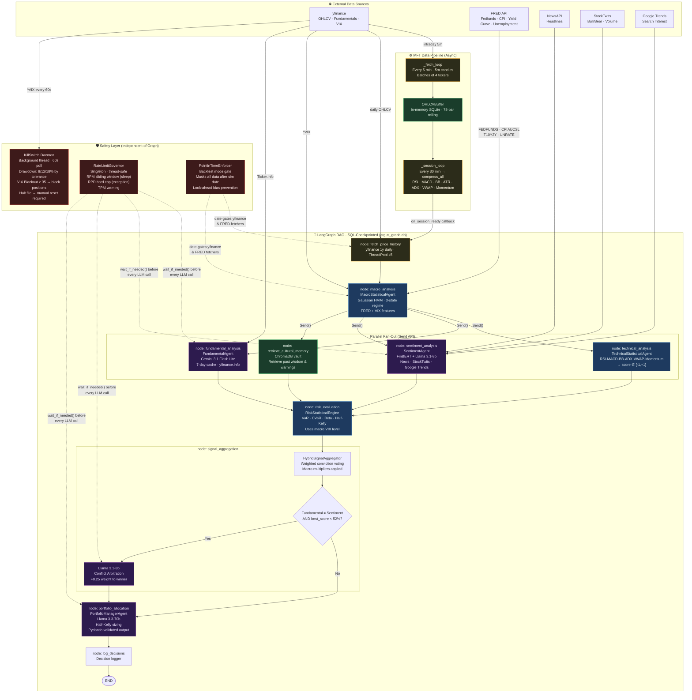

# ARGUS v2 — Multi-Agent Financial Intelligence System

> **RESEARCH PROJECT ONLY — NOT FINANCIAL ADVICE.** ARGUS is not registered with the SEC or any regulatory body. All outputs are for educational and research purposes only. Do not make investment decisions based on this system's output.

ARGUS v2 is an institutional-grade, multi-agent AI system that performs parallel quantitative analysis across six specialist agents — technical, macro, fundamental, sentiment, risk, and portfolio — to produce structured investment theses over a configurable equity universe. The system enforces strict look-ahead bias prevention via point-in-time data gating, runs as a LangGraph DAG with SQL-backed checkpointing, and ships with a Backtrader walk-forward validation engine and a FastAPI + Streamlit frontend.

---

## Architecture



---

## Quick Start (Docker)

**Prerequisites:** Docker, Docker Compose, and valid API keys.

```bash
# 1. Clone
git clone https://github.com/your-org/argus-v2.git
cd argus-v2/argus

# 2. Configure environment
cp .env.example .env
# Edit .env and fill in all API keys (see Keys section below)
> StockTwits and Google Trends require no API key. Run `pip install -e .` and both sources work immediately.

# 3. Build and launch
docker compose build
docker compose up -d

# 4. Verify API health
curl http://localhost:8000/health

# 5. Open dashboard
open http://localhost:8501
```

---

## Local Development Setup

```bash
cd argus
python -m venv .venv && source .venv/bin/activate
pip install -e ".[dev]"

# Start API
uvicorn api.main:app --reload --port 8000

# Start UI (separate terminal)
streamlit run ui/app.py --server.port 8501
```

---

## Required API Keys

| Key | Source | Purpose |
|-----|--------|---------|
| `GROQ_API_KEY` | [console.groq.com](https://console.groq.com) | Llama 3.3-70b synthesis + sentiment |
| `GOOGLE_AI_API_KEY` | [aistudio.google.com](https://aistudio.google.com) | Gemini fundamental analysis |
| `FRED_API_KEY` | [fred.stlouisfed.org](https://fred.stlouisfed.org/docs/api/api_key.html) | Macro data (CPI, Fed Funds, Yield Curve) |
| `NEWSAPI_KEY` | [newsapi.org](https://newsapi.org) | News sentiment headlines |

---

## Backtesting

```bash
# Via API (async, polled)
curl -X POST http://localhost:8000/backtest \
  -H "Content-Type: application/json" \
  -d '{
    "tickers": ["AAPL","MSFT","NVDA","JPM","XOM"],
    "start_date": "2021-01-04",
    "end_date":   "2024-12-31",
    "initial_cash": 100000,
    "risk_tolerance": "MODERATE",
    "run_bias_audit": true
  }'

# Poll for result
curl http://localhost:8000/backtest/<job_id>
```

Walk-forward validation uses rolling 6-month train / 1-month out-of-sample windows across the full date range. Results include Sharpe, Sortino, Max Drawdown, VaR, and an automated bias audit (look-ahead, survivorship, data-quality).

---

## Kill Switch Reset

If a drawdown halt is triggered, an `argus_halt_<timestamp>.json` file is written to disk. After reviewing the situation:

```bash
# Delete the halt file (manual confirmation step)
rm argus_halt_*.json

# Then reset via API with new inception value
curl -X POST "http://localhost:8000/kill-switch/reset?new_inception_value=100000"
```

---

## Running Tests

```bash
cd argus
pip install -e ".[test]"
python -m pytest tests/ -v --tb=short
```

All 7 integration tests pass against the live statistical pipeline (real yfinance data). LLM agents are automatically mocked via `pytest-mock`.

---

## Tech Stack

| Component | Technology |
|-----------|-----------|
| Orchestration | LangGraph 0.2+ with SQL checkpointer |
| LLM Inference | Groq (Llama 3.3-70b, Llama 3.1-8b) + Google Gemini Flash Lite |
| Regime Classification | Gaussian HMM (`hmmlearn`) |
| Sentiment | FinBERT (`ProsusAI/finbert`) + Llama synthesis |
| Technical Indicators | `pandas-ta` (RSI, MACD, BB, ATR, ADX, VWAP) |
| Macro Data | FRED API via `fredapi` |
| Market Data | `yfinance` |
| Backtesting | `backtrader` with custom ARGUS strategy wrapper |
| Memory | ChromaDB (cultural memory vault) |
| API | FastAPI + Uvicorn |
| UI | Streamlit + Plotly |
| Deployment | Docker Compose / Render.com |
| CI | GitHub Actions |

---

## Deployment on Render

1. Push repository to GitHub
2. Connect repo in [Render dashboard](https://render.com)
3. Render auto-detects `render.yaml` — click **Deploy**
4. Add all env vars in the Render environment settings
5. First deploy takes ~5 minutes (model downloads)

---

## Disclaimer

**ARGUS v2 is a research and educational project. It is NOT:**
- Registered investment advice
- A licensed financial advisor
- Compliant with any securities regulation

**All generated portfolio allocations, signals, and recommendations are purely synthetic outputs of a machine learning model trained on historical data. Past performance does not predict future results. You could lose money. Always consult a licensed financial professional before making investment decisions.**
