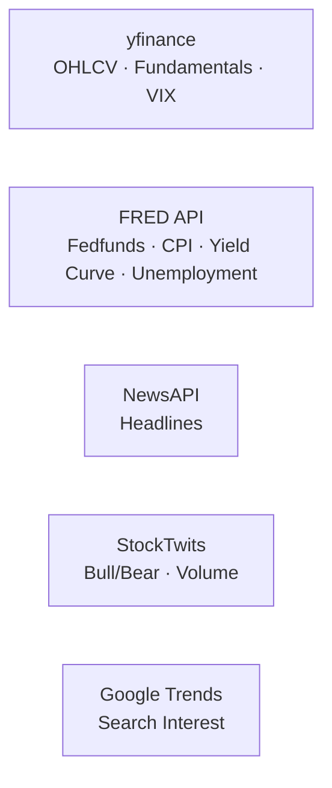

# ARGUS — Architecture Deep Dive

> **Historical document — pre-rebuild (superseded 2026-08-11).**
>
> This is the architecture description as it stood *before* the rebuild
> documented in [issue #1](https://github.com/nevilcp/argus/issues/1). It is
> kept unmodified, and moved here rather than deleted, because it is the
> primary evidence for the central finding of
> [`docs/case-study.md`](../case-study.md): that this document described
> mechanisms the code did not implement. Most notably it describes a
> `_resolve_conflict()` LLM call for breaking split votes that was never in
> the repository at all. [ADR 0010](../adr/0010-closing-the-decision-outcome-loop.md)
> and [ADR 0011](../adr/0011-reliability-weighting.md) cite it for the same
> reason.
>
> **Do not read this as a description of the current system.** For that, see
> `README.md` and `docs/adr/`.

This document walks through the Mermaid diagram in `README.md` layer by layer, mapping every box and arrow to the actual source code so you can understand precisely what runs, when, why, and how it connects to everything else.

---

## The Big Picture

ARGUS is structured as **four concentric rings** of responsibility:

```
┌──────────────────────────────────────────────────────┐
│  🌐  External Data Sources   (APIs — outside process) │
│  ⚙️  MFT Data Pipeline       (async intraday feed)    │
│  🔁  LangGraph DAG           (per-tick decision cycle) │
│  🛡️  Safety Layer            (independent daemons)     │
└──────────────────────────────────────────────────────┘
```

Data flows **inward**: raw market/macro feeds → pipeline → DAG agents → portfolio decision. The Safety Layer sits **orthogonally** — it watches the DAG from the outside and can veto or halt it at any time, entirely independently.

---

## Layer 1 — 🌐 External Data Sources



These are the five real-world API integrations that feed every agent in the system.

| Source | What it provides | Who consumes it |
|---|---|---|
| **yfinance** | Intraday 5m OHLCV candles, daily 1y OHLCV, `Ticker.info` fundamentals, `^VIX` spot price | MFT pipeline (5m candles), `fetch_price_history` node (1y daily), Fundamental agent, Macro agent, KillSwitch |
| **FRED API** | `FEDFUNDS`, `CPIAUCSL`, `T10Y2Y`, `UNRATE` — the four macroeconomic series | Macro agent (HMM features) |
| **NewsAPI** | Recent news headlines and article bodies for each ticker | Sentiment agent |
| **StockTwits** | Bull/bear percentage splits, message volume (public API, no key needed) | Sentiment agent |
| **Google Trends** | Retail search interest/volume surge via `pytrends` (no key needed) | Sentiment agent |

> [!NOTE]
> yfinance is the only source consumed by **multiple** layers simultaneously: the MFT pipeline uses it for intraday candles, the DAG's first node uses it for daily history, the fundamental agent reads `Ticker.info`, the macro agent reads `^VIX`, and the KillSwitch polls `^VIX` every 60 seconds independently.

---

## Layer 2 — ⚙️ MFT Data Pipeline (Async)

**File:** `argus/data/pipeline.py`

This is the **real-time heartbeat** of the system. It runs as two concurrent `asyncio` coroutines that wake the rest of the system on a schedule.

```
yfinance (5m candles)
       │
       ▼
  _fetch_loop ──────────────────────────────────────────────────
  • Runs every 300 s (5 min)                                    │
  • Processes tickers in batches of 4                           │
  • 13-second sleep between individual ticker fetches           │
    (keeps requests < 5/min, respecting free-tier limits)       │
  • Market-hours guard: idles silently outside 09:30–16:00 ET   │
       │                                                         │
       ▼                                                         │
  OHLCVBuffer (in-memory SQLite, rolling 78-bar window)         │
       │                                                         │
       ▼                                                         │
  _session_loop ───────────────────────────────────────────────┘
  • Runs every 1,800 s (30 min)
  • Calls compress_all() → runs pandas-ta on buffered candles
  • Computes: RSI·MACD·BB·ATR·ADX·VWAP·Momentum
  • Fires on_session_ready(session_states) callback
       │
       ▼
  LangGraph DAG triggered ──────────────────────────────────────
```

### Key design decisions

- **78-bar rolling window**: 78 five-minute candles = exactly one full trading day (6.5 hours × 12 bars/hour). This is why the buffer size is exactly 78 — `compress_all()` always has a full day's worth of intraday data to feed `pandas-ta`.
- **Batch of 4 tickers × 13-second sleep**: `4 × 13 = 52 seconds`, ensuring fewer than 5 requests per 60-second window — the Polygon free-tier limit (even though the pipeline currently uses yfinance, the architecture is designed to migrate to a Polygon websocket in future).
- **`OHLCVBuffer`** is backed by in-memory SQLite (`:memory:`), not a file. It is fast, self-contained, and ephemeral — it does not persist across restarts.

---

## Layer 3 — 🔁 LangGraph DAG

**File:** `argus/orchestration/graph.py`

This is the **core reasoning engine**. It is a Directed Acyclic Graph (DAG) compiled by LangGraph, backed by a persistent SQLite checkpointer (`argus_graph.db`). Every run of the graph is checkpointed, so if the process crashes mid-way through a cycle, LangGraph can resume from the last completed node.

The graph executes nodes in this order:

```
fetch_price_history
       │
       ▼
macro_analysis
       │
       │  (Send API — parallel fan-out)
       ├─────────────────────────────────────────────────┐
       │                    │                  │          │
       ▼                    ▼                  ▼          ▼
technical_analysis   fundamental_analysis  sentiment  retrieve_cultural_memory
       │                    │              _analysis         │
       └────────────────────┴──────────────────┴────────────┘
                                    │
                                    ▼
                           risk_evaluation
                                    │
                                    ▼
                          signal_aggregation
                                    │
                                    ▼
                         portfolio_allocation
                                    │
                                    ▼
                             log_decisions
                                    │
                                    ▼
                                   END
```

### Node 0 — `fetch_price_history`

**What:** Calls `fetch_multiple_daily(universe, period="1y")` — downloads 1 year of daily OHLCV for every ticker in the equity universe, using a `ThreadPool` of 5 concurrent threads.

**Why this node exists:** The downstream agents (technical, risk) need a full year of daily price history to calculate meaningful statistics (Beta, VaR, CVaR, momentum). The intraday buffer from the MFT pipeline provides short-term features; this node provides the long-term picture.

**Output into state:** `price_history` — a dict of `{ticker: {dates: [...], prices: [...]}}`.

**Triggered by:** Either the `_session_loop`'s `on_session_ready` callback (live mode) or `argus/backtesting/replay.py` (fixture-session replay). Both paths feed `ARGUSState.universe` as the starting input.

---

### Node 1 — `macro_analysis` (MacroStatisticalAgent)

**File:** `argus/agents/macro.py`

**What:** Fetches the four FRED series + `^VIX` from yfinance, then fits a **Gaussian Hidden Markov Model (HMM)** with 3 hidden states using `hmmlearn`.

**The 5 features fed into the HMM:**

| Feature | Source | Meaning |
|---|---|---|
| `FEDFUNDS` | FRED | Monetary policy tightness |
| `CPIAUCSL` | FRED | Inflation pressure (YoY % change) |
| `T10Y2Y` | FRED | Yield curve shape (inversion = recession signal) |
| `UNRATE` | FRED | Labor market health |
| `^VIX` | yfinance | Market fear / implied volatility |

The HMM learns that these 5 features cluster into 3 distinct hidden states. ARGUS labels them **EXPANSION, CONTRACTION, TRANSITIONAL** based on which state has the highest average VIX (CONTRACTION) vs. lowest (EXPANSION).

**Output:** A `MacroContext` Pydantic object containing:
- `regime` — the current state label
- `vix_level` — current VIX reading
- `agent_multipliers` — conviction weights per agent (e.g., EXPANSION boosts `fundamental` multiplier; CONTRACTION boosts `technical` and dampens `fundamental`)

This is the **most strategically important node** in the graph because `agent_multipliers` modulates every downstream vote.

---

### Parallel Fan-Out — Send API

After `macro_analysis` completes, the graph uses LangGraph's `Send()` API to dispatch four nodes **simultaneously**. This is the key performance optimization: rather than running technical → fundamental → sentiment sequentially (slow), all four run at the same time, reducing total latency by ~3-4×.

```python
builder.add_conditional_edges("macro_analysis",
    lambda s: [
        Send("technical_analysis", s),
        Send("fundamental_analysis", s),
        Send("sentiment_analysis", s),
        Send("retrieve_cultural_memory", s)
    ]
)
```

The graph then waits for **all four** to complete before proceeding to `risk_evaluation`.

---

### Node 2 — `technical_analysis` (TechnicalStatisticalAgent) 🔵 *Stat*

**File:** `argus/agents/technical.py`

**What:** Runs `pandas-ta` deterministic indicators on the `session_states` dict produced by the MFT pipeline. No LLM is involved — this is pure math.

**Indicators computed:** RSI (14), MACD histogram (12/26/9), Bollinger %B (20), ATR % (14), ADX (14), VWAP distance, momentum (30m and 1d).

**Output:** A `TechnicalSignal` per ticker with a `score ∈ [-1, +1]` and a `signal` enum (BULLISH / BEARISH / NEUTRAL).

**Why no LLM:** LLMs can hallucinate numerical analysis. Technical indicators are mathematically deterministic — there is no reason to introduce stochasticity. This is a deliberate architectural choice to keep the technical leg "clean."

---

### Node 3 — `fundamental_analysis` (FundamentalAgent) 🟣 *LLM*

**File:** `argus/agents/fundamental.py`

**What:** Calls `yfinance.Ticker.info` to pull financial metrics (P/E, revenue growth, operating margin, net margin, ROE, D/E, FCF yield), then passes them to **Gemini 3.1 Flash Lite** to generate a qualitative fundamental thesis.

**7-day cache:** To avoid burning API quota on re-fetching fundamentals that change slowly, the agent caches results per ticker for 7 days. If a cached result exists, the LLM call is skipped entirely.

**Output:** A `FundamentalSignal` per ticker with `signal`, `conviction`, `moat_score`, and a narrative thesis string.

---

### Node 4 — `sentiment_analysis` (SentimentAgent) 🟣 *LLM*

**File:** `argus/agents/sentiment.py`

**What:** Three sub-pipelines run per ticker:
1. **NewsAPI** → headline text → **FinBERT** (transformer, no LLM call, local) → polarity scores
2. **StockTwits** public API → bull/bear ratio and volume
3. **Google Trends** (`pytrends`) → search interest surge

The raw scores are then synthesized by **Llama 3.1-8b** (Groq) into a `SentimentSignal`.

**Why FinBERT + Llama?** FinBERT is a domain-fine-tuned BERT model specialized in financial text — it runs locally with no API cost, is fast, and is accurate for headline polarity. Llama is used for the higher-level synthesis because it can reason over multiple inputs (news + social + trends) and weigh them contextually.

**Output:** A `SentimentSignal` per ticker with `signal`, `finbert_net_score`, and `conviction`.

---

### Node 5 — `retrieve_cultural_memory` (ChromaDB) 🟢 *Data*

**File:** `argus/memory/cultural.py`

**What:** Queries a **ChromaDB** vector database (persisted in `chroma_db/`) for past trading wisdom and warnings relevant to the current macro regime and technical conditions.

**Why:** ARGUS is designed to improve across sessions. Over time, the memory vault accumulates observations like "in CONTRACTION regimes with VIX > 25, tech stocks underperformed" — retrieved via semantic similarity search. The `portfolio_allocation` node reads these as advisory context.

**Output:** `cultural_wisdom` and `cultural_warnings` lists of strings — injected directly into the Portfolio Manager's prompt.

---

### Node 6 — `risk_evaluation` (RiskStatisticalEngine) 🔵 *Stat*

**File:** `argus/agents/risk.py`

**What:** Uses the 1-year daily price history from `fetch_price_history` to compute:

| Metric | What it measures |
|---|---|
| **VaR (95%)** | Maximum expected 1-day loss in 95% of scenarios |
| **CVaR (95%)** | Average loss in the worst 5% of scenarios (tail risk) |
| **Beta** | Correlation of stock returns to the market (S&P 500) |
| **Half-Kelly** | Optimal position size = (win probability × edge) / odds × 0.5 |

Also ingests the current VIX level from `macro_context` — a high VIX inflates the risk scores, reducing suggested position sizes.

**No LLM:** Again, purely statistical. Risk math must be deterministic and reproducible.

**Output:** A `RiskAssessment` per ticker with VaR, CVaR, Beta, and suggested Kelly-sized position weight.

---

### The Aggregation Sub-Graph — `signal_aggregation`

**File:** `argus/orchestration/aggregator.py`

This is the most intellectually interesting part of the DAG. The `HybridSignalAggregator` combines the outputs of the four parallel agents into a single `AggregatedSignal` per ticker.

#### Weighted Conviction Voting

Each agent's signal (BULLISH / BEARISH / NEUTRAL) is cast as a weighted vote:

```
vote weight = agent.conviction × macro.agent_multipliers[agent_name] × (agent_reliability / 0.5)
```

The `agent_multipliers` come from `MacroContext` — the macro regime directly adjusts how much each agent's vote counts. Example:
- In **EXPANSION**: fundamental multiplier is boosted (good earnings matter more), technical is slightly dampened
- In **CONTRACTION**: technical multiplier rises (price action matters more), fundamental is dampened (earnings lag)

`agent_reliability` is that agent's shrinkage-adjusted historical win rate for the
current regime, from `cultural.get_agent_accuracy()` (see ADR 0011): an agent
sitting at the neutral 0.5 prior — no history yet, or exactly break-even — votes
at its unscaled base weight; a regime-specific track record above or below 0.5
scales its vote up or down accordingly. This is the mechanism that closes the
decision→outcome→reliability loop: agents that have been right in this regime
count for more.

The bull/bear/neutral vote pools are summed and normalized to a percentage of
the total; the highest-percentage pool wins, capped at `AGGREGATOR.max_conviction`
so no aggregate ever claims certainty. There is no separate conflict-resolution
LLM call — the whole aggregation is a pure, deterministic function of the four
signal inputs plus reliability, which is what makes it property-testable
(`tests/test_aggregator_properties.py`) and reusable, unmodified, as the ablation
step in `orchestration/reconciliation.py`'s credit assignment.

**Output:** `AggregatedSignal` per ticker with `signal`, `conviction`, `weighted_votes`.

---

### Node 7 — `portfolio_allocation` (PortfolioManagerAgent) 🟣 *LLM*

**File:** `argus/agents/portfolio.py`

**What:** The final synthesis step. Passes the full `signals_dict` (technical + fundamental + sentiment + risk + aggregated per ticker), the `MacroContext`, and the retrieved `cultural_wisdom` to **Llama 3.3-70b** (Groq's most powerful model).

**Why the 70b model here specifically:** This is the highest-stakes decision in the system — the actual portfolio weights. Using the most capable model here maximizes the quality of the final output.

**Pydantic validation:** The portfolio agent enforces a strict output schema via Pydantic. The LLM output is parsed and validated — the allocations must sum to ≤ 100%, all weights must be positive, and the output must pass sanity checks. This prevents LLM hallucinations from producing invalid portfolios.

**Half-Kelly sizing:** Rather than full Kelly (which is mathematically aggressive), ARGUS uses half-Kelly to be more conservative. The Kelly fraction = `(win_probability × edge) / odds`, then multiplied by 0.5.

**Output:** A `PortfolioAllocation` containing per-ticker target weights and a narrative investment thesis.

---

### Nodes 8 & END — `log_decisions` → END

Appends `ARGUSDecision` objects to the state's audit trail (using LangGraph's `operator.add` reducer) and snapshots each one to ChromaDB as `PENDING` via `CulturalMemoryManager.store_decision_snapshot`. The `argus_graph.db` checkpoint file preserves the full decision history — including nested technical/fundamental/sentiment signals — across runs, keyed by `thread_id` per session.

**Closing the loop (PR 8):** `argus/orchestration/reconciliation.py` is the second half of the story `log_decisions` starts. Run periodically (`scripts/reconcile_outcomes.py`), it reads every session's decisions back out of `argus_graph.db` (`load_decisions_from_checkpoints`), and for any decision whose `RECONCILIATION.horizon_days` has elapsed since `session_timestamp`:

1. **Credit assignment** — `credit_primary_driver()` reruns `HybridSignalAggregator.aggregate()` once per specialist agent with that agent's signal removed (leave-one-out ablation), and credits whichever removal either flips the consensus direction or, failing that, contributed the largest raw vote.
2. **Outcome** — `compute_realized_return()` pairs the decision's entry price (`technical.current_price`) with the close price at or after the target exit date, via the same `MarketDataProvider` seam every other node uses.
3. **Persistence** — `cultural.store_trade_outcome()` (previously written, never called — the original defect this whole rebuild started from) writes the realized return, holding period, and ablation-derived `primary_driver` to ChromaDB, upserted as a separate `trade_{decision_id}` document alongside the original `snapshot_{decision_id}` one.

See [`docs/adr/0010-closing-the-decision-outcome-loop.md`](adr/0010-closing-the-decision-outcome-loop.md) for why decisions are read back from the existing checkpoint rather than a dedicated archive (the now-deleted `DecisionLogger` used to fill that role and was never instantiated), and why the ablation metric compares direction-flip-then-magnitude rather than a raw conviction delta.

---

## Layer 4 — 🛡️ Safety Layer (Independent of Graph)

This is the critical insight of the architecture: **the safety systems run in completely separate threads/processes and are not nodes in the graph**. They cannot be bypassed by graph logic.

### KillSwitch Daemon 🔴

**File:** `argus/risk/kill_switch.py`

Runs as a **background daemon thread** (`threading.Thread(daemon=True)`) that wakes every 60 seconds and polls two conditions:

| Condition | Action |
|---|---|
| Drawdown ≥ threshold | **FULL HALT** — writes `argus_halt_<timestamp>.json` to disk. System cannot restart until file is manually deleted. |
| VIX ≥ 35 | **BLOCK NEW POSITIONS** — sets a threading event. Auto-clears when VIX normalizes. |

**Drawdown thresholds by risk tolerance:**
- CONSERVATIVE: 8%
- MODERATE: 12%
- AGGRESSIVE: 18%

**Why the halt file?** The halt condition requires a human to manually `rm argus_halt_*.json` and call `/kill-switch/reset`. This is an intentional circuit-breaker pattern — no automated restart is allowed after a drawdown event. A human must review what happened.

> [!IMPORTANT]
> Halt events are written to `runs/argus_halt_<timestamp>.json` (gitignored, not checked into the repo) — the kill switch has genuinely triggered on a drawdown during testing. `runs/` is empty in a fresh checkout; a halt file only appears after a real trigger.

### RateLimitGovernor 🔴

**File:** `argus/orchestration/governor.py`

A **thread-safe singleton** (`governor = RateLimitGovernor()`) that every LLM-calling agent calls via `governor.wait_if_needed(model_name, estimated_tokens)` **before** making any API request.

It enforces three limits simultaneously:

| Limit | Mechanism |
|---|---|
| **RPM** (requests/minute) | Sliding window of call timestamps. If `len(window) ≥ rpm_limit`, it **sleeps** until the window clears. |
| **RPD** (requests/day) | Hard counter. If exceeded, raises `RateLimitExceeded` exception — the calling agent catches this and skips the LLM call. |
| **TPM** (tokens/minute) | Warning only — logs if a single call would use >90% of the per-minute token budget. |

**Which nodes call the governor:**

```
governor.wait_if_needed() → called by:
  N3  (FundamentalAgent    → gemini-3.1-flash-lite)
  N4  (SentimentAgent      → llama-3.1-8b-instant)
  AGG2 (ConflictArbitrator → llama-3.1-8b-instant)
  N7  (PortfolioManager   → llama-3.3-70b-versatile)
```

The purely statistical nodes (N1, N2, N6) never call the governor because they make no LLM calls.

### Point-in-time correctness (structural, not a runtime enforcer)

**File:** `argus/backtesting/replay.py`

There used to be a `PointInTimeEnforcer` here: a date-gating mechanism that
intercepted `yfinance`/FRED calls during backtest mode and masked data after
a simulated date. It's gone — deleted along with the rest of the
walk-forward backtesting engine it existed to serve (see
[`docs/adr/0009-no-multiyear-backtest.md`](adr/0009-no-multiyear-backtest.md)
for why multi-year backtesting isn't offered at all).

What replaced it isn't a runtime check but a structural property: PR 7's
`replay.py` replays recorded fixture *sessions* through the real graph, and
each session's `FixtureMarketDataProvider` is scoped to its own directory —
there is no code path by which a later session's data could reach an
earlier one, so there's nothing for a runtime enforcer to guard against.

`ARGUSState` still carries `backtest_mode: bool` and
`session_seed: Optional[int]`, consumed by `FundamentalAgent.analyze` for
ticker anonymization (`argus/agents/fundamental.py`) — that mechanism is
separate from point-in-time data gating and remains in place.

---

## How Everything Fits Together: The Full Execution Flow

```
[Market opens 09:30 ET]
        │
        ▼
MFT _fetch_loop wakes every 5 min
  └─ fetches 5m candles for all tickers → OHLCVBuffer
        │
[30 minutes later]
        ▼
MFT _session_loop fires
  └─ compress_all() → computes RSI/MACD/BB/etc.
  └─ fires on_session_ready(session_states) callback
        │
        ▼
LangGraph DAG invoked with ARGUSState
  │
  ├─ fetch_price_history → 1y daily OHLCV for universe
  ├─ macro_analysis     → HMM classifies regime + VIX → MacroContext + multipliers
  │
  ├─ [PARALLEL FAN-OUT]
  │   ├─ technical_analysis   → pandas-ta on session_states → TechnicalSignal per ticker
  │   ├─ fundamental_analysis → Gemini 3.1 Flash Lite + yfinance.info → FundamentalSignal
  │   ├─ sentiment_analysis   → FinBERT + Llama 3.1-8b → SentimentSignal
  │   └─ retrieve_cultural_memory → ChromaDB semantic search → wisdom/warnings
  │
  ├─ risk_evaluation → VaR/CVaR/Beta/Half-Kelly from 1y returns + VIX
  │
  ├─ signal_aggregation
  │   ├─ Weighted conviction voting (with macro multipliers)
  │   └─ [if conflict & close vote] → Llama 3.1-8b arbitration
  │
  ├─ portfolio_allocation → Llama 3.3-70b + cultural_wisdom → Pydantic-validated weights
  │
  └─ log_decisions → audit trail → argus_graph.db checkpoint
        │
        ▼
[Result served via FastAPI → Streamlit UI]

[Meanwhile, independently]
  KillSwitch (60s poll) ──────────────────────────────────────────────────
    │ VIX ≥ 35?   → block new positions (auto-clears when VIX normalizes)
    │ Drawdown ≥ threshold? → write halt file → FULL STOP (manual reset)
  RateLimitGovernor (per LLM call) ────────────────────────────────────────
    │ RPM exceeded? → sleep until window clears
    │ RPD exceeded? → raise exception, skip LLM call
```

---

## Component Color Legend (from the Mermaid Styles)

| Color | Type | Nodes |
|---|---|---|
| 🔵 Dark blue | **Statistical** (no LLM, pure math) | `macro_analysis`, `technical_analysis`, `risk_evaluation` |
| 🟣 Purple | **LLM** (language model involved) | `fundamental_analysis`, `sentiment_analysis`, conflict arbitrator, `portfolio_allocation` |
| 🔴 Dark red | **Safety** (daemons/guards) | `KillSwitch`, `RateLimitGovernor` |
| 🟢 Dark green | **Data/Memory** | `OHLCVBuffer`, `retrieve_cultural_memory` |
| 🟡 Dark yellow | **I/O** (data fetch nodes) | `fetch_price_history`, `_fetch_loop`, `_session_loop` |

This color-coding is a key design communication: the diagram immediately tells you whether a node uses an LLM (audit-worthy, has latency/cost), is statistical (fast, deterministic, safe), or is a safety layer component (operates outside normal control flow).

---

## Key Architectural Principles Illustrated by the Diagram

1. **Separation of statistical and LLM reasoning**: Pure math never goes through an LLM. LLMs are only used where qualitative synthesis is genuinely needed (fundamental thesis, sentiment synthesis, conflict arbitration, portfolio narration).

2. **Macro as the regime gatekeeper**: The macro node runs *before* the fan-out precisely because its output (`agent_multipliers`) modulates every other agent's vote. It is the single most important contextual frame.

3. **Safety is orthogonal to correctness**: The Safety Layer deliberately does not participate in the DAG. It cannot be blocked by a buggy node, a slow LLM call, or a graph checkpoint. It watches from outside.

4. **Conflict resolution is lazy**: The debate loop only fires when there is a genuine, close disagreement between fundamental and sentiment. This saves LLM calls in ~80% of cases where the signals agree or the margin is clear.

5. **Backtest integrity by construction**: `replay.py` doesn't gate data at fetch time — each recorded session is scoped to its own fixture directory, so there is no code path by which a later session's data could reach an earlier one. See [`docs/adr/0009-no-multiyear-backtest.md`](adr/0009-no-multiyear-backtest.md).
